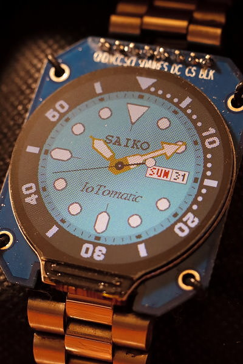
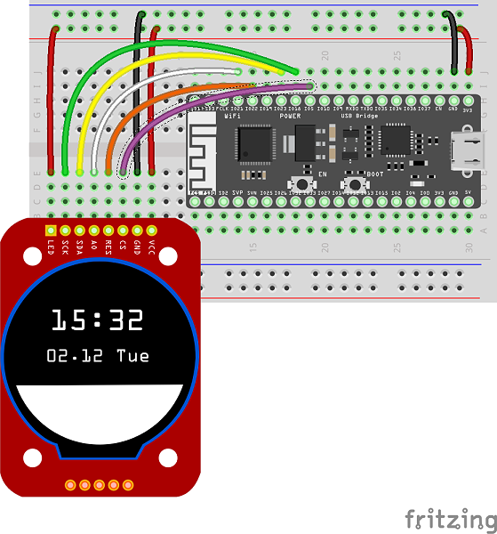

# "Saiko" IoTomatic Watch with ESP32 and Round LCD

**"Saiko(u)" (さいこう)** is an ESP32-based NTP clock using a GC9A01A round TFT LCD (240x240 pixels).

The analog dial design is drawn mostly in real time by code and is based on/inspired by the **Seiko 5 Sports SRPK33K1** 38mm diver watch, with the second hand moves 6 times a second as in the 4R36 mechanical movement. The dates do not rotate like the real movement though.

The project is not meant for commerical use. You can read more about the more detailed story on [my Hackster.io project page](https://www.hackster.io/alankrantas/saiko-iotomatic-watch-d619e5).

## Wiring

| ESP32 | GC9A01A |
| --- | --- |
| GND | GND |
| 3.3V | VCC |
| 18 (SCK) | SCL |
| 23 (MOSI) | SDA |
| 22 | RES (RST) |
| 21 | DC |
| 5 | CS |
| 3.3V | BLK (backlight) |

## Libraries

- [Arduino NTPClient](https://github.com/arduino-libraries/NTPClient)
- [Adafruit GFX Library](https://github.com/adafruit/Adafruit-GFX-Library)
- [Adafruit GC9A01A Library](https://github.com/adafruit/Adafruit_GC9A01A)

> Note: The clock will try to update time from the NTP server every 30 minutes.
>
> However, the `NTPClient` may cause several-second blocking delays (which cause the watch temporarily stopped moving) due to internet or NTP issues. There are currently no good way around this but to change a better NTP server and/or a better WiFi environment depending on where you are.

## Clock Setup

- Change the `SECRET_SSID` and `SECRET_PASS` to your WiFi ssid/password in `secret.h`.
- Modify `NTP_SERVER` and `NTP_HOUR_OFFSET` to a setting you perfer.
- If `DEMO_MODE` is set to `true`, the watch will display a fixed time (`10:31:42 SUN 31th`) without connnecting to WiFi.
- If `BENCHMARK` is set to `true`, it will calculate and print the time needed to draw the watch dial.

### Advanced

- Most specs and color on the dial can actually be adjusted, for example:
  - `LOGO_NAME` is the name shown on the top half of watch, and `DESCRIPTION` is the smaller text on the lower half.
  - `SECOND_HAND_VIBRATION` defines the the second hand vibrations (`6` = 3 Hz). The code automatically calculates the drawing cycle time and the second hand moving angle.
- The parts of the hour and minute hands are identified by alphabet codes, since I do not know how to name them:

